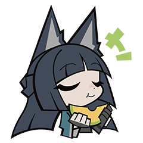

<h1 align="center">𝓐𝓸𝔂𝓪𝓰𝓲 𝓡𝓲𝔂𝓪</h1>

    <table width="100%">
        <tr>
            <td width="50%" align="center">An ordinary high school student in China. I like anime, PC games and more. Actually, I don't have much time to learn programming, because school life takes up most of my time.</td>
            <td width="50%" align="center"></td>
        </tr>
    </table>

<h2 align="center">🛠️ Skills & Learning</h2>

    
    
    
    

<h2 align="center">🌠 Wishlist</h2>
<table align="center">
  <tr>
    <td>
      <ul type="none" align="center">
        <li>Get into a good university</li>
        <li>Learn to draw</li>
        <li>Become a game developer</li>
        <li>Visit a comic convention (Comicup) in Shanghai</li>
        <li>Travel to Tokyo · China–Japan friendship</li>
      </ul>
    </td>
  </tr>
</table>

